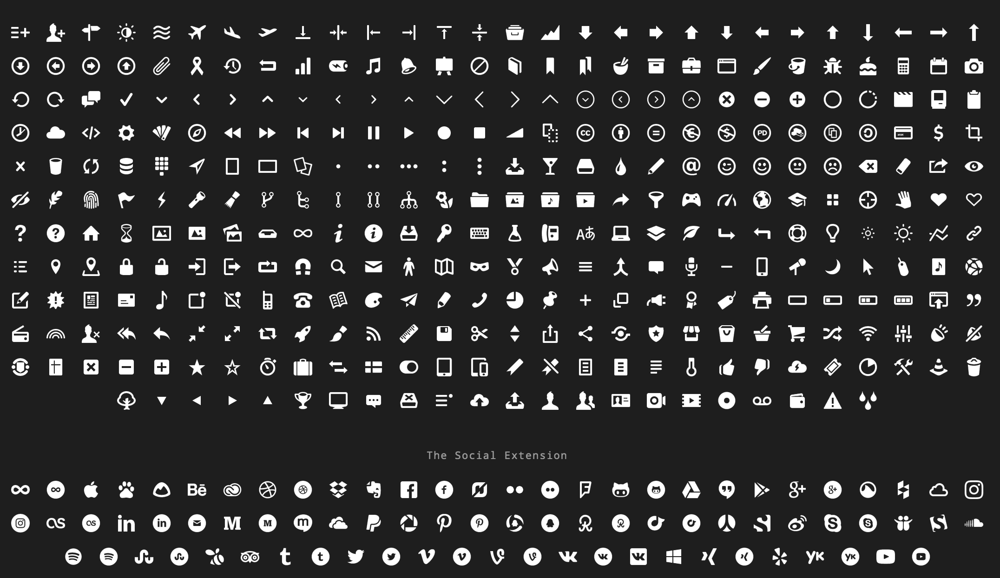

# entypo

SVG sprite for the [Entypo+](http://entypo.com) icon collection.

[![npm][npm-image]][npm-url]
[![travis][travis-image]][travis-url]
[![devDependencies Status][davidDev-img]][davidDev-url]
[![standard][standard-image]][standard-url]

[npm-image]: https://img.shields.io/npm/v/entypo.svg?style=flat-square
[npm-url]: https://www.npmjs.com/package/entypo
[travis-image]: https://img.shields.io/travis/hypermodules/entypo.svg?style=flat-square
[travis-url]: https://travis-ci.org/hypermodules/entypo
[davidDev-img]: https://david-dm.org/hypermodules/entypo/dev-status.svg?style=flat-square
[davidDev-url]: https://david-dm.org/hypermodules/entypo?type=dev
[standard-image]: https://img.shields.io/badge/code%20style-standard-brightgreen.svg?style=flat-square
[standard-url]: http://npm.im/standard

## About

This is a [node](https://nodejs.org) module that packages the [Entypo+](http://entypo.com) icon collection as a SVG sprite.

### What is Entypo?

__411 carefully crafted premium pictograms by [Daniel Bruce](http://www.danielbruce.se/) - [CC BY-SA 4.0](https://creativecommons.org/licenses/by-sa/4.0/).__



See [entypo.com](http://entypo.com) for more information.

### What is a SVG sprite?

A SVG sprite is a hidden SVG element inserted at the top of the body element that defines a set of icons with unique IDs. These icons can later be referenced throughout the document with the [`<use>` element](https://developer.mozilla.org/en-US/docs/Web/SVG/Element/use).

Read [Icon System with SVG Sprites](https://css-tricks.com/svg-sprites-use-better-icon-fonts/) by [Chris Coyier](http://chriscoyier.net/) for more information.

## Install

```
npm install entypo
```

## Usage

In your JavaScript:

```js
const entypo = require('entypo')

document.body.insertBefore(entypo.getNode(), document.body.firstChild)
```

In your HTML:

```html
<svg><use xlink:href="#entypo-star" /></svg>
```

In your CSS:

```css
svg {
  fill: #fff;
}
```

### API

#### `entypo()`

- [function](https://developer.mozilla.org/en-US/docs/Web/JavaScript/Reference/Global_Objects/Function): returns svg sprite file contents as utf-8 text

You can insert this into the page easily using the [DOM API](https://developer.mozilla.org/en-US/docs/Web/API/Document_Object_Model).  This works by specifying [brfs](https://github.com/substack/brfs) in the [browserify transform field](https://github.com/browserify/browserify-handbook#browserifytransform-field).  You may need a special fs loader in webpack if its not picking up the transform.

#### `entypo.getNode()`

- [function](https://developer.mozilla.org/en-US/docs/Web/JavaScript/Reference/Global_Objects/Function): returns svg sprite DOM node

This a convenience function that returns the svg sprite as a [DOM Node](https://developer.mozilla.org/en-US/docs/Web/API/Node) so that it can be inserted into the `body` element using the DOM API.

##### Example

```js
document.body.insertBefore(entypo.getNode(), document.body.firstChild)
```

#### `entypo.htmlToElement(html: string)`

- [function](https://developer.mozilla.org/en-US/docs/Web/JavaScript/Reference/Global_Objects/Function): converts a string to a DOM node

This is a utility function used by `getNode()` to convert the raw SVG text provided by the main `entypo()` function into a DOM node.

#### `entypo.path`

- [string](https://developer.mozilla.org/en-US/docs/Web/JavaScript/Reference/Global_Objects/String): path to svg sprite (e.g. `node_modules/entypo/dist/sprite.svg`)


### Icon Names

#### Entypo+

Icon | Name
:--: | ----
 | `entypo-add-to-list`
 | `entypo-add-user`
 | `entypo-address`
 | `entypo-adjust`
 | `entypo-air`
 | `entypo-aircraft-landing`
 | `entypo-aircraft-take-off`
 | `entypo-aircraft`
 | `entypo-align-bottom`
 | `entypo-align-horizontal-middle`
 | `entypo-align-left`
 | `entypo-align-right`
 | `entypo-align-top`
 | `entypo-align-vertical-middle`
 | `entypo-archive`
 | `entypo-area-graph`
 | `entypo-arrow-bold-down`
 | `entypo-arrow-bold-left`
 | `entypo-arrow-bold-right`
 | `entypo-arrow-bold-up`
 | `entypo-arrow-down`
 | `entypo-arrow-left`
 | `entypo-arrow-long-down`
 | `entypo-arrow-long-left`
 | `entypo-arrow-long-right`
 | `entypo-arrow-long-up`
 | `entypo-arrow-right`
 | `entypo-arrow-up`
 | `entypo-arrow-with-circle-down`
 | `entypo-arrow-with-circle-left`
 | `entypo-arrow-with-circle-right`
 | `entypo-arrow-with-circle-up`
 | `entypo-attachment`
 | `entypo-awareness-ribbon`
 | `entypo-back-in-time`
 | `entypo-back`
 | `entypo-bar-graph`
 | `entypo-battery`
 | `entypo-beamed-note`
 | `entypo-bell`
 | `entypo-blackboard`
 | `entypo-block`
 | `entypo-book`
 | `entypo-bookmark`
 | `entypo-bookmarks`
 | `entypo-bowl`
 | `entypo-box`
 | `entypo-briefcase`
 | `entypo-browser`
 | `entypo-brush`
 | `entypo-bucket`
 | `entypo-bug`
 | `entypo-cake`
 | `entypo-calculator`
 | `entypo-calendar`
 | `entypo-camera`
 | `entypo-ccw`
 | `entypo-chat`
 | `entypo-check`
 | `entypo-chevron-down`
 | `entypo-chevron-left`
 | `entypo-chevron-right`
 | `entypo-chevron-small-down`
 | `entypo-chevron-small-left`
 | `entypo-chevron-small-right`
 | `entypo-chevron-small-up`
 | `entypo-chevron-thin-down`
 | `entypo-chevron-thin-left`
 | `entypo-chevron-thin-right`
 | `entypo-chevron-thin-up`
 | `entypo-chevron-up`
 | `entypo-chevron-with-circle-down`
 | `entypo-chevron-with-circle-left`
 | `entypo-chevron-with-circle-right`
 | `entypo-chevron-with-circle-up`
 | `entypo-circle-with-cross`
 | `entypo-circle-with-minus`
 | `entypo-circle-with-plus`
 | `entypo-circle`
 | `entypo-circular-graph`
 | `entypo-clapperboard`
 | `entypo-classic-computer`
 | `entypo-clipboard`
 | `entypo-clock`
 | `entypo-cloud`
 | `entypo-code`
 | `entypo-cog`
 | `entypo-colours`
 | `entypo-compass`
 | `entypo-controller-fast-backward`
 | `entypo-controller-fast-forward`
 | `entypo-controller-jump-to-start`
 | `entypo-controller-next`
 | `entypo-controller-paus`
 | `entypo-controller-play`
 | `entypo-controller-record`
 | `entypo-controller-stop`
 | `entypo-controller-volume`
 | `entypo-copy`
 | `entypo-creative-commons-attribution`
 | `entypo-creative-commons-noderivs`
 | `entypo-creative-commons-noncommercial-eu`
 | `entypo-creative-commons-noncommercial-us`
 | `entypo-creative-commons-public-domain`
 | `entypo-creative-commons-remix`
 | `entypo-creative-commons-share`
 | `entypo-creative-commons-sharealike`
 | `entypo-creative-commons`
 | `entypo-credit-card`
 | `entypo-credit`
 | `entypo-crop`
 | `entypo-cross`
 | `entypo-cup`
 | `entypo-cw`
 | `entypo-cycle`
 | `entypo-database`
 | `entypo-dial-pad`
 | `entypo-direction`
 | `entypo-document-landscape`
 | `entypo-document`
 | `entypo-documents`
 | `entypo-dot-single`
 | `entypo-dots-three-horizontal`
 | `entypo-dots-three-vertical`
 | `entypo-dots-two-horizontal`
 | `entypo-dots-two-vertical`
 | `entypo-download`
 | `entypo-drink`
 | `entypo-drive`
 | `entypo-drop`
 | `entypo-edit`
 | `entypo-email`
 | `entypo-emoji-flirt`
 | `entypo-emoji-happy`
 | `entypo-emoji-neutral`
 | `entypo-emoji-sad`
 | `entypo-erase`
 | `entypo-eraser`
 | `entypo-export`
 | `entypo-eye-with-line`
 | `entypo-eye`
 | `entypo-feather`
 | `entypo-fingerprint`
 | `entypo-flag`
 | `entypo-flash`
 | `entypo-flashlight`
 | `entypo-flat-brush`
 | `entypo-flow-branch`
 | `entypo-flow-cascade`
 | `entypo-flow-line`
 | `entypo-flow-parallel`
 | `entypo-flow-tree`
 | `entypo-flower`
 | `entypo-folder-images`
 | `entypo-folder-music`
 | `entypo-folder-video`
 | `entypo-folder`
 | `entypo-forward`
 | `entypo-funnel`
 | `entypo-game-controller`
 | `entypo-gauge`
 | `entypo-globe`
 | `entypo-graduation-cap`
 | `entypo-grid`
 | `entypo-hair-cross`
 | `entypo-hand`
 | `entypo-heart-outlined`
 | `entypo-heart`
 | `entypo-help-with-circle`
 | `entypo-help`
 | `entypo-home`
 | `entypo-hour-glass`
 | `entypo-image-inverted`
 | `entypo-image`
 | `entypo-images`
 | `entypo-inbox`
 | `entypo-infinity`
 | `entypo-info-with-circle`
 | `entypo-info`
 | `entypo-install`
 | `entypo-key`
 | `entypo-keyboard`
 | `entypo-lab-flask`
 | `entypo-landline`
 | `entypo-language`
 | `entypo-laptop`
 | `entypo-layers`
 | `entypo-leaf`
 | `entypo-level-down`
 | `entypo-level-up`
 | `entypo-lifebuoy`
 | `entypo-light-bulb`
 | `entypo-light-down`
 | `entypo-light-up`
 | `entypo-line-graph`
 | `entypo-link`
 | `entypo-list`
 | `entypo-location-pin`
 | `entypo-location`
 | `entypo-lock-open`
 | `entypo-lock`
 | `entypo-log-out`
 | `entypo-login`
 | `entypo-loop`
 | `entypo-magnet`
 | `entypo-magnifying-glass`
 | `entypo-mail`
 | `entypo-man`
 | `entypo-map`
 | `entypo-mask`
 | `entypo-medal`
 | `entypo-megaphone`
 | `entypo-menu`
 | `entypo-merge`
 | `entypo-message`
 | `entypo-mic`
 | `entypo-minus`
 | `entypo-mobile`
 | `entypo-modern-mic`
 | `entypo-moon`
 | `entypo-mouse-pointer`
 | `entypo-mouse`
 | `entypo-music`
 | `entypo-network`
 | `entypo-new-message`
 | `entypo-new`
 | `entypo-news`
 | `entypo-newsletter`
 | `entypo-note`
 | `entypo-notification`
 | `entypo-notifications-off`
 | `entypo-old-mobile`
 | `entypo-old-phone`
 | `entypo-open-book`
 | `entypo-palette`
 | `entypo-paper-plane`
 | `entypo-pencil`
 | `entypo-phone`
 | `entypo-pie-chart`
 | `entypo-pin`
 | `entypo-plus`
 | `entypo-popup`
 | `entypo-power-plug`
 | `entypo-price-ribbon`
 | `entypo-price-tag`
 | `entypo-print`
 | `entypo-progress-empty`
 | `entypo-progress-full`
 | `entypo-progress-one`
 | `entypo-progress-two`
 | `entypo-publish`
 | `entypo-quote`
 | `entypo-radio`
 | `entypo-remove-user`
 | `entypo-reply-all`
 | `entypo-reply`
 | `entypo-resize-100%`
 | `entypo-resize-full-screen`
 | `entypo-retweet`
 | `entypo-rocket`
 | `entypo-round-brush`
 | `entypo-rss`
 | `entypo-ruler`
 | `entypo-save`
 | `entypo-scissors`
 | `entypo-select-arrows`
 | `entypo-share-alternative`
 | `entypo-share`
 | `entypo-shareable`
 | `entypo-shield`
 | `entypo-shop`
 | `entypo-shopping-bag`
 | `entypo-shopping-basket`
 | `entypo-shopping-cart`
 | `entypo-shuffle`
 | `entypo-signal`
 | `entypo-sound-mix`
 | `entypo-sound-mute`
 | `entypo-sound`
 | `entypo-sports-club`
 | `entypo-spreadsheet`
 | `entypo-squared-cross`
 | `entypo-squared-minus`
 | `entypo-squared-plus`
 | `entypo-star-outlined`
 | `entypo-star`
 | `entypo-stopwatch`
 | `entypo-suitcase`
 | `entypo-swap`
 | `entypo-sweden`
 | `entypo-switch`
 | `entypo-tablet-mobile-combo`
 | `entypo-tablet`
 | `entypo-tag`
 | `entypo-text-document-inverted`
 | `entypo-text-document`
 | `entypo-text`
 | `entypo-thermometer`
 | `entypo-thumbs-down`
"> | `entypo-thumbs-up`
 | `entypo-thunder-cloud`
 | `entypo-ticket`
 | `entypo-time-slot`
 | `entypo-tools`
 | `entypo-traffic-cone`
 | `entypo-trash`
 | `entypo-tree`
 | `entypo-triangle-down`
 | `entypo-triangle-left`
 | `entypo-triangle-right`
 | `entypo-triangle-up`
 | `entypo-trophy`
 | `entypo-tv`
 | `entypo-typing`
 | `entypo-uninstall`
 | `entypo-unread`
 | `entypo-untag`
 | `entypo-upload-to-cloud`
 | `entypo-upload`
 | `entypo-user`
 | `entypo-users`
 | `entypo-v-card`
 | `entypo-video-camera`
 | `entypo-video`
 | `entypo-vinyl`
 | `entypo-voicemail`
 | `entypo-wallet`
 | `entypo-warning`
 | `entypo-water`

#### Entypo+ Social Extension


Icon | Name
---- | ----
 | `entypo-500px-with-circle`
 | `entypo-500px`
 | `entypo-app-store`
 | `entypo-baidu`
 | `entypo-basecamp`
 | `entypo-behance`
 | `entypo-creative-cloud`
 | `entypo-dribbble-with-circle`
 | `entypo-dribbble`
 | `entypo-dropbox`
 | `entypo-evernote`
 | `entypo-facebook-with-circle`
 | `entypo-facebook`
 | `entypo-flattr`
 | `entypo-flickr-with-circle`
 | `entypo-flickr`
 | `entypo-foursquare`
 | `entypo-github-with-circle`
 | `entypo-github`
 | `entypo-google+-with-circle`
 | `entypo-google+`
 | `entypo-google-drive`
 | `entypo-google-hangouts`
 | `entypo-google-play`
 | `entypo-grooveshark`
 | `entypo-houzz`
 | `entypo-icloud`
 | `entypo-instagram-with-circle`
 | `entypo-instagram`
 | `entypo-lastfm-with-circle`
 | `entypo-lastfm`
 | `entypo-linkedin-with-circle`
 | `entypo-linkedin`
 | `entypo-mail-with-circle`
 | `entypo-medium-with-circle`
 | `entypo-medium`
 | `entypo-mixi`
 | `entypo-onedrive`
 | `entypo-paypal`
 | `entypo-picasa`
 | `entypo-pinterest-with-circle`
 | `entypo-pinterest`
 | `entypo-qq-with-circle`
 | `entypo-qq`
 | `entypo-raft-with-circle`
 | `entypo-raft`
 | `entypo-rainbow`
 | `entypo-rdio-with-circle`
 | `entypo-rdio`
 | `entypo-renren`
 | `entypo-scribd`
 | `entypo-sina-weibo`
 | `entypo-skype-with-circle`
 | `entypo-skype`
 | `entypo-slideshare`
 | `entypo-smashing`
 | `entypo-soundcloud`
 | `entypo-spotify-with-circle`
 | `entypo-spotify`
 | `entypo-stumbleupon-with-circle`
 | `entypo-stumbleupon`
 | `entypo-swarm`
 | `entypo-tripadvisor`
 | `entypo-tumblr-with-circle`
 | `entypo-tumblr`
 | `entypo-twitter-with-circle`
 | `entypo-twitter`
 | `entypo-vimeo-with-circle`
 | `entypo-vimeo`
 | `entypo-vine-with-circle`
 | `entypo-vine`
 | `entypo-vk-alternitive`
 | `entypo-vk-with-circle`
 | `entypo-vk`
 | `entypo-windows-store`
 | `entypo-xing-with-circle`
 | `entypo-xing`
 | `entypo-yelp`
 | `entypo-youko-with-circle`
 | `entypo-youko`
 | `entypo-youtube-with-circle`
 | `entypo-youtube`

## Example

To see an example implementation, try `npm run example`. Source code is in [`example.js`](example.js).

## Contributing

Contributions welcome! Please read the [contributing guidelines](CONTRIBUTING.md) first.

Daniel Bruce, if you are reading this, send me an email if you want commit / release access.

## License

- Module: [ISC](LICENSE.md)
- Icons: [CC BY-SA 4.0](https://creativecommons.org/licenses/by-sa/4.0/).
